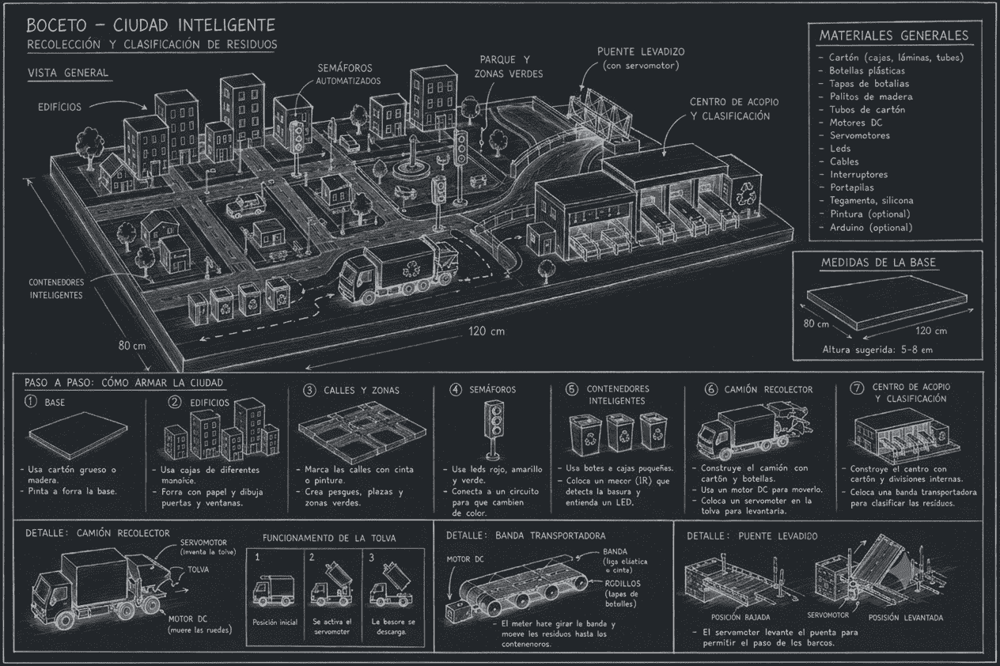
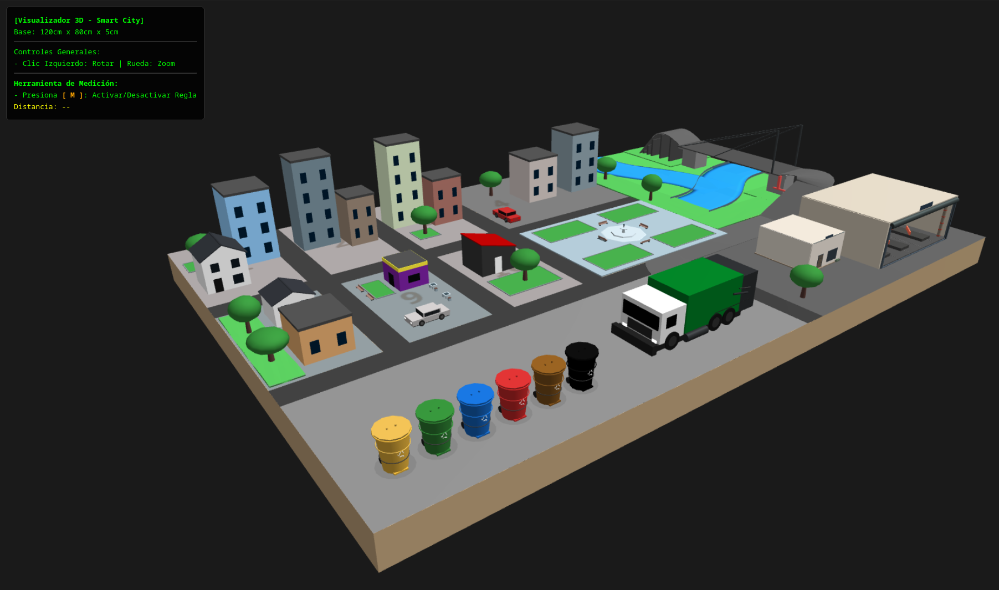

# Smart City: Automatización Urbana Prototipada

  &nbsp;
  &nbsp;
  &nbsp;
  &nbsp;
  

## Descripción
Modelo a escala de una ciudad inteligente que integra automatización y sistemas embebidos para la optimización de la gestión de residuos y la infraestructura urbana.

  

## 🏗️ Sobre el Proyecto

La ciudad integra sistemas críticos de gestión automatizada:

- **Gestión de Residuos:** Contenedores inteligentes con sensores de proximidad y camión recolector automatizado.
- **Infraestructura:** Semáforos inteligentes y puentes levadizos accionados por servomotores.
- **Procesamiento:** Control centralizado basado en Arduino y cableado estructurado tipo arnés.

### Estado Actual

| **Módulo**       | **Estado** | **Progreso** |
| ---------------- | ---------- | ------------ |
| **Esquemáticos** | Prototipo  | 0%           |
| **Firmware**     | Prototipo  | 0%           |
| **Diseño CAD**   | Prototipo  | 100%         |

## 🛠️ Stack Tecnológico

- **Lenguajes:** C++ (Firmware), JavaScript (Interfaz de control).
- **Hardware:** Arduino (Controlador principal), Servomotores, Motores DC, Sensores IR.
- **Diseño:** CAD para estructuras mecánicas y chasis.
- **Entorno:** Desarrollado en Fedora 43 bajo shell `fish`.

## 📁 Estructura del Repositorio

.
├── assets/ # Recursos visuales (planos, renders, fotos)
├── docs/ # Documentación y panel de control web
├── electronica/ # Esquemáticos y diseño de arnés de cables
├── firmware/ # Código fuente para microcontroladores
├── hardware/ # Diseños mecánicos y chasis
└── JOURNAL.md # Registro de bitácora y lecciones aprendidas

## 🚀 Guía de Inicio

_(Pendiente de completar conforme avances en el desarrollo del firmware y la electrónica)_

## 💡 Referencia de Diseño

El diseño base se sustenta en la integración de sistemas con actuadores electrónicos:

_Proyecto bajo desarrollo. Actualmente en fase de integración mecánica y planificación de la capa de control._
